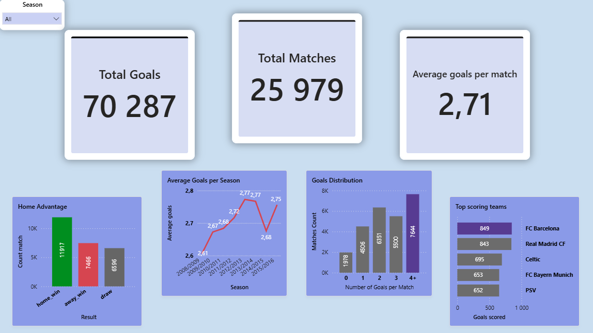

# ⚽ Аналіз футбольних матчів

## 📊 Опис проєкту

Цей проєкт присвячений аналізу футбольних матчів з використанням **SQL, Python (Pandas) та Power BI**.

Основна мета:

* проаналізувати результати матчів
* дослідити розподіл голів
* оцінити ефективність команд
* знайти тренди по сезонах

---

## 🛠 Технології

* **SQL** — аналіз даних
* **Python (Pandas)** — обробка та трансформація даних
* **Power BI** — візуалізація та дашборд

---

## 📁 Структура проєкту

```
football-analysis/
│
├── dashboard/        # Power BI дашборд (.pbix + зображення)
├── data/             # сирі дані (не включені в репозиторій)
├── datasets/         # SQL-скрипти для створення датасетів
├── python/           # скрипти для завантаження та обробки даних
├── sql/              # аналітичні SQL-запити
```

---

## 📈 Дашборд



Дашборд включає:

* загальну кількість матчів і голів
* середню кількість голів за матч
* аналіз переваги домашнього поля
* розподіл голів за матч
* топ команд за кількістю голів
* тренд середньої результативності по сезонах

---

## ⚠️ Дані

Файл бази даних не доданий у репозиторій через великий розмір.

---

## 🚀 Основні інсайти

* Домашні команди перемагають частіше за виїзні
* Найчастіше в матчах забивається 2–3 голи
* Є команди, які стабільно мають високу результативність
* Середня кількість голів змінюється залежно від сезону

---

## 👨‍💻 Автор

Павло Юсик
